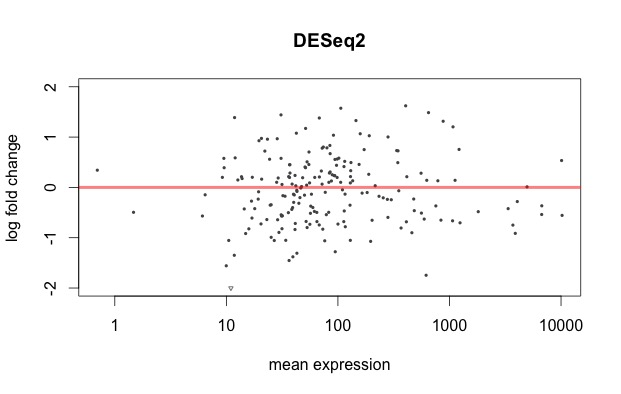
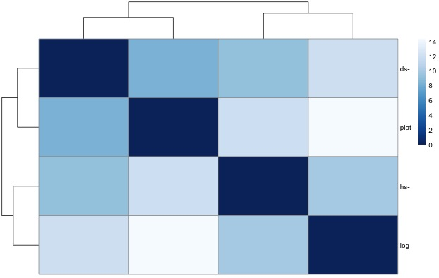
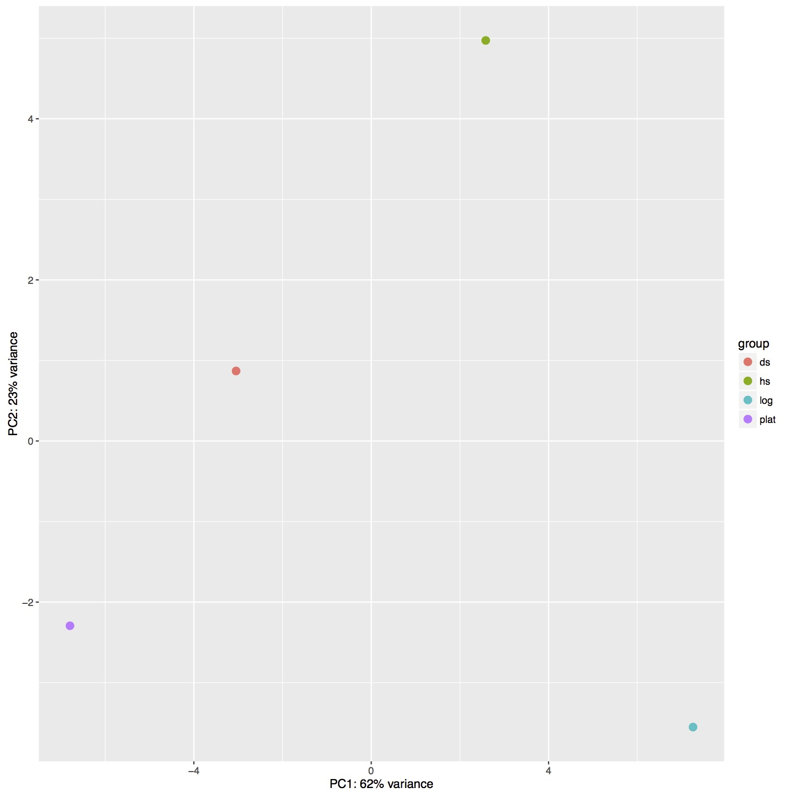
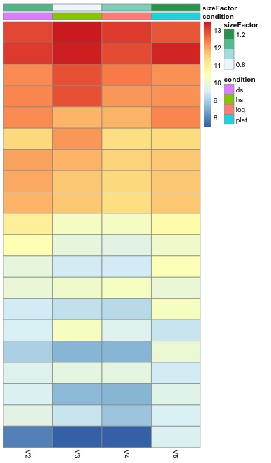

> ## Objetivos de aprendizaje {.objectives}
>
> *  Aprender a realizar análisis de expresión diferencial usando DESeq2

> ## Datos requeridos {.prereq}
>
> Para proceder con esta práctica, se requieren:
>
> *  El genoma [Sp_genome.fa](datasets/genome/Sp_genome.fa) 
> *  Las lecturas no filtradas 

Utilizaremos los archivos bam filtrados por calidad que utilizamos en la clase 
de mapeo. Los análisis se realizaran en la plataforma R.

Generemos un directorio de trabajo

~~~ {.bash}
$ mkdir DESEQ2
$ cd DESEQ2/
~~~

## Contando lecturas

El primer paso es contar lecturas. Tanto DESeq2 como otros programas que usan
la distribución negativa binomial utilizan conteos **crudos** (raw). Esto 
se refiere la número de lecturas que alinean a un transcrito específico sin 
sufrir ningún tipo de transformación. Como vieron en la clase pasada, esto se 
debe a que el programa estima un factor de normalización. Si usamos datos 
previamente normalizados estaremos violando los supuestos. 

Descargaremos la anotación de los de *Schizosaccharomyces pombe* genes de aquí:

~~~ {.bash}
$  wget https://liz-fernandez.github.io/Talleres_Bioinfo_Cuernavaca_17/datasets/genome/Sp_genes.gtf
~~~

Usaremos el programa [HTSeq](https://pypi.python.org/packages/source/H/HTSeq/).

Este programa cuenta el número de lecturas que alinean con cada gen anotado en un archivo 
de referencia. Nosotros le proporcionaremos nuestro archivo `Sp_genes.gtf`.

~~~ {.bash}
$ htseq-count -f bam -s no -r pos Sp_ds.bam Sp_genes.gtf > Sp_ds.counts &
$ htseq-count -f bam -s no -r pos Sp_hs.bam Sp_genes.gtf > Sp_hs.counts &
$ htseq-count -f bam -s no -r pos Sp_log.bam Sp_genes.gtf > Sp_log.counts &
$ htseq-count -f bam -s no -r pos Sp_plat.bam Sp_genes.gtf > Sp_plat.counts &
~~~

> ## Contando librerías de manera independiente {.challenge}
>
> ¿Por qué contamos las lecturas en cada librería de manera independiente si
> ensamblamos el transcriptoma usando todas las lecturas? 
> 

Es importante verificar que el conteo de HTSeq engloba a la mayoría de las lecturas. 
Si estos porcentajes son muy bajos podrían indicar problemas con los parámetros de 
conteo (e.g. si le decimos que nuestra muestra no tiene direccionalidad (strandness)
cuando si la tiene).

Finalmente uniremos los resultados usando el siguiente comando:

~~~ {.bash}
$ paste $( ls *counts | grep cufflinks -v) | cut -f 1,2,4,6,8 | grep '__' -v > Sp_counts_table.txt
$ head Sp_Counts_Table.txt
~~~

Esto unió los distintos archivos en uno solo el cual ya podemos utilizar en R. 
Es importante verificar el orden de pegado de los archivos para no confundir una 
muestra con otra. 

~~~ {.output}
SPAC1002.19	24	45	3	239
SPAC1093.06c	50	22	34	60
SPAC10F6.01c	376	330	534	206
SPAC10F6.05c	63	101	34	145
SPAC11D3.18c	25	11	12	23
SPAC11E3.06	28	8	5	4
SPAC11E3.14	407	152	55	396
SPAC11H11.04	17	7	12	23
SPAC1250.07	73	36	29	74
SPAC12B10.14c	73	38	52	50
~~~

### Análisis de expresión diferencial

Ahora instalamos y cargamos el paquete `DESeq2`:

~~~ {.r}
source("http://bioconductor.org/biocLite.R")
biocLite("DESeq2")
library(“DESeq2”)
~~~

Este paquete estima una distribución negativa binomial.

Leemos las cuentas en R usando read.delim:

~~~ {.r}
> countData <- read.delim("./Sp_counts_table.txt",header=FALSE, row.names=1)
> head(countData)
~~~

~~~ {.output}
              V2  V3  V4  V5
SPAC1002.19   24  45   3 239
SPAC1093.06c  50  22  34  60
SPAC10F6.01c 376 330 534 206
SPAC10F6.05c  63 101  34 145
SPAC11D3.18c  25  11  12  23
SPAC11E3.06   28   8   5   4
~~~ 

Y añadimos la descripción de cada una de las muestras. 
Este es el orden en el cual las "pegamos" usando el comando `paste`. 
Como ya mencionamos, en sus experimentos deberán cerciorarse de que este orden es 
el correcto.

~~~ {.r}
condition <- factor(c("ds","hs","log","plat"))
colData <- data.frame(row.names=colnames(countData), condition)
head(colData)
~~~

~~~ {.output}
   condition
V2        ds
V3        hs
V4       log
V5      plat
~~~ 

Una vez ensamblados nuestros datos podemos usar la función DESeqDataSetFromMatrix para 
ponerlo en el formato requerido por DESeq2:

~~~ {.r}
dds <- DESeqDataSetFromMatrix(countData = countData,
                              colData = colData,
                              design = ~ condition )
dds
~~~
~~~ {.output}
class: DESeqDataSet 
dim: 200 4 
exptData(0):
assays(1): counts
rownames(200): SPAC1002.19 SPAC1093.06c ... SPCC794.10 SPCP25A2.02c
rowData metadata column names(0):
colnames(4): V2 V3 V4 V5
colData names(1): condition
~~~

Filtramos genes con muy muy baja expresión, en este caso todos aquellos que no tengan al
menos una lectura. Nota: DESeq2 aplica otros filtros más estrictos por default.

~~~ {.r}
dds <- dds[ rowSums(counts(dds)) > 1, ]
dds
~~~

~~~ {.output}
class: DESeqDataSet 
dim: 198 4 
exptData(0):
assays(1): counts
rownames(198): SPAC1002.19 SPAC1093.06c ... SPCC794.10 SPCP25A2.02c
rowData metadata column names(0):
colnames(4): V2 V3 V4 V5
colData names(1): condition
~~~ 

La funcion DESeq realiza el análisis estándar de expresión diferencial, 
incluyendo los pasos de estimación de la distribución. 
Esta función genera una tabla con cambios de expresión en base log2, 
así como p-values y p-values ajustados por pruebas múltiples. 

~~~ {.r}
dds <- DESeq(dds)
~~~
~~~ {.output}
estimating size factors
estimating dispersions
gene-wise dispersion estimates
mean-dispersion relationship
NOTE: fitType='parametric', but the dispersion trend was not well captured by the
  function: y = a/x + b, and a local regression fit was automatically substituted.
  specify fitType='local' or 'mean' to avoid this message next time.
final dispersion estimates
fitting model and testing
Warning message:
In .local(object, ...) : same number of samples and coefficients to fit,
  estimating dispersion by treating samples as replicates.
  read the ?DESeq section on 'Experiments without replicates'
~~~

Este error nos indica que DESeq2 ha aplicado un filtro aún más estricto ya que, 
debido a la falta de réplicas, no tiene manera de saber cuanta dispersión en 
los niveles de expresión se debe a variación biológica o a diferencia entre los 
distintos tratamientos. 

~~~ {.r}
dds
~~~
~~~ {.output}
class: DESeqDataSet 
dim: 198 4 
exptData(0):
assays(3): counts mu cooks
rownames(198): SPAC1002.19 SPAC1093.06c ... SPCC794.10 SPCP25A2.02c
rowData metadata column names(37): baseMean baseVar ... deviance maxCooks
colnames(4): V2 V3 V4 V5
colData names(2): condition sizeFactor
~~~

> ## Diseño multifactorial {.callout}
> 
> Experimentos con mas de un factor se pueden analizar usando DESeq2 al incluirse 
> las variables adicionales. Por ejemplo, si se realizaron los mismos experimentos 
> en distintos grupos o batches podemos corregir errores experimentales. 
> Cada factor añadido incrementa la sensibilidad a diferencias causadas por la condición. 
> 
> Por ejemplo, podríamos añadir los siguientes factores
>
> ~~~ {.output}
> colData(dds)
> ## DataFrame with 7 rows and 3 columns
> ## condition type sizeFactor
> ## <factor> <factor> <numeric>
> ## treated1fb treated single-read 1.512
> ## treated2fb treated paired-end 0.784
> ## treated3fb treated paired-end 0.896
> ## untreated1fb untreated single-read 1.050
> ## untreated2fb untreated single-read 1.659
> ## untreated3fb untreated paired-end 0.712
> ## untreated4fb untreated paired-end 0.784
> ~~~
>
> Y analizarlos así para comparar el tipo de librería con el tratamiento
> 
> ~~~ {.r}
> design(ddsMF) <- formula(~ type + condition)
> ddsMF <- DESeq(ddsMF)
> ~~~
>

Podemos extraer los resultados usando la función res:

~~~ {.r}
res <- results(dds)
res
~~~
~~~ {.output}
log2 fold change (MAP): condition plat vs ds 
Wald test p-value: condition plat vs ds 
DataFrame with 6 rows and 6 columns
              baseMean log2FoldChange     lfcSE       stat    pvalue      padj
             <numeric>      <numeric> <numeric>  <numeric> <numeric> <numeric>
SPAC1002.19   68.10299     1.37929086 1.0630096  1.2975338 0.1944476 0.9704666
SPAC1093.06c  38.84823     0.06599578 0.6115834  0.1079097 0.9140673 0.9704666
SPAC10F6.01c 368.22680    -0.80731941 0.9035895 -0.8934582 0.3716119 0.9704666
SPAC10F6.05c  84.74091     0.83338935 0.8311666  1.0026743 0.3160180 0.9704666
SPAC11D3.18c  16.79657    -0.27280407 0.7300479 -0.3736797 0.7086426 0.9704666
SPAC11E3.06   10.98535    -2.00717671 1.0185420 -1.9706371 0.0487654 0.9704666
~~~

Podemos obtener más información acerca de cada columna:

~~~ {.r}
mcols(res)$description
~~~
~~~ {.output}
[1] "mean of normalized counts for all samples"   
[2] "log2 fold change (MAP): condition plat vs ds"
[3] "standard error: condition plat vs ds"        
[4] "Wald statistic: condition plat vs ds"        
[5] "Wald test p-value: condition plat vs ds"     
[6] "BH adjusted p-values"
~~~ 

La función `summary` nos proporciona un resumen de los indicadores de nuestros
resultados.

~~~ {.r}
summary(res)
~~~
~~~ {.output}
out of 198 with nonzero total read count
adjusted p-value < 0.1
LFC > 0 (up)     : 0, 0% 
LFC < 0 (down)   : 0, 0% 
outliers [1]     : 0, 0% 
low counts [2]   : 0, 0% 
(mean count < 0.7)
[1] see 'cooksCutoff' argument of ?results
[2] see 'independentFiltering' argument of ?results
~~~

¿Qué nos sugieren estos resultados? Si vemos una gráfica MA vemos que no hay 
ningún gen con expresión diferencial significativa:

~~~ {.r}
plotMA(res, main="DESeq2", ylim=c(-2,2))
~~~

Como pueden ver estos resultados solo muestran la comparación entre las condiciones
'plat' y 'ds'. Para extraer otros contrastes extraemos distintas parte de los 
resultados guardados en dds usando la función `results`.

Extraemos todas las combinaciones:

~~~ {.r}
res_ds_vs_hs <- results(dds,contrast=c("condition","ds","hs"))
res_ds_vs_log <- results(dds,contrast=c("condition","ds","log"))
res_ds_vs_plat <- results(dds,contrast=c("condition","ds","plat"))
res_hs_vs_log <- results(dds,contrast=c("condition","hs","log"))
res_hs_vs_plat <- results(dds,contrast=c("condition","hs","plat"))
res_log_vs_plat <- results(dds,contrast=c("condition","log","plat"))
~~~

Y los escribimos a archivos planos (Solo se muestra el ejemplo del primer archivo):

~~~ {.r}
res_ds_vs_hs <- res_ds_vs_hs[order(res_ds_vs_hs$padj),]  # Ordenando
# Datos sin filtrar
write.csv(as.data.frame(subset(res_ds_vs_hs)),file="Results_ds_vs_hs_unfiltered.csv", quote=FALSE)
# Datos filtrados
write.csv(as.data.frame(subset(res_ds_vs_hs, padj < 0.1)),file="Results_ds_vs_hs_padj0.05.csv", quote=FALSE)
~~~

### Revisando efectos de grupo (batch effects)

Un efecto de grupo es cuando hay una diferencia entre tratamientos no debido
a cambios biológicos si no a la manera en que fue procesada la muestra. 

Para verificar los datos usamos transformaciones y visualizaciones. 
Como ejemplo, transformaremos los datos de expresión usando la transformación 
rlog. Estas transformaciones permiten visualizar mejor los datos aunque, como en todos
los casos, es bueno verificar que nuestros datos cumplen con los supuestos requeridos.
En este caso se requiere que los datos no difieran mucho entre las distintas condiciones. 

~~~ {.r}
rld <- rlogTransformation(dds, blind=FALSE) 
sampleDistsRLD <- dist(t(assay(rld)))
library("RColorBrewer")
sampleDistMatrixRLD <- as.matrix(sampleDistsRLD)
rownames(sampleDistMatrixRLD) <- paste(rld$condition, rld$type, sep="-")
colnames(sampleDistMatrixRLD) <- NULL

colors <- colorRampPalette( rev(brewer.pal(9, "Blues")) )(255)
pheatmap(sampleDistMatrixRLD,
         clustering_distance_rows=sampleDistsRLD,
         clustering_distance_cols=sampleDistsRLD,
         col=colors)
~~~

Ahora imprimimos un análisis de componentes principales (PCA). 

~~~ {.r}
pdf("Sp_Samples_PCA_rlogTransformed.pdf",10,10)
plotPCA(rld)
dev.off()
~~~

### Visualizando grupos de genes

Una de las maneras más comunes de visualizar genes es usando un heatmap. Un heatmap
es un gráfico con recuadros que representan la expresión de cada gen. Es importante
mencionar que los heatmaps son útiles pero pueden sesgar nuestros resultados, por ello
es importante seleccionar los genes a visualizar por medio de bases estadísticas y 
estar concientes de los parámetros de visualización que cambian la escala de los datos. 

Visualicemos los 20 genes más expresados en nuestro datos usando el paquete "pheatmap". 

~~~ {.r}
install.packages("pheatmap")
library("pheatmap")
select <- order(rowMeans(counts(dds,normalized=TRUE)),decreasing=TRUE)[1:20]
df <- as.data.frame(colData(dds))
pheatmap(assay(rld)[select,], cluster_rows=FALSE, show_rownames=FALSE,
+          cluster_cols=FALSE, annotation_col=df)
~~~ 

Existen muchas otras opciones de análisis y visualizaciones, las cuales pueden
consultar en la [Viñeta de DESeq2](https://www.bioconductor.org/packages/3.3/bioc/vignettes/DESeq2/inst/doc/DESeq2.pdf).

