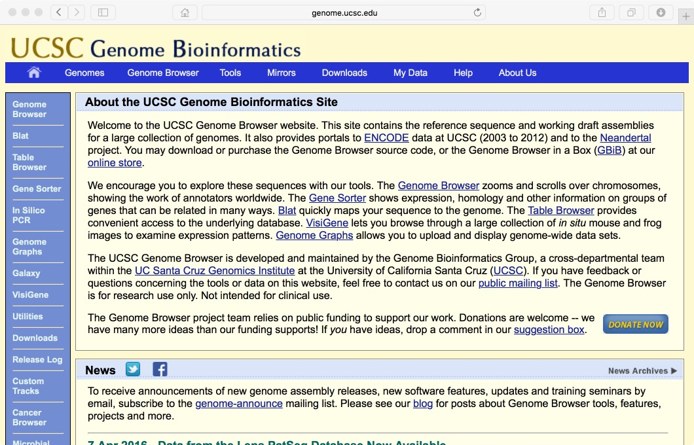
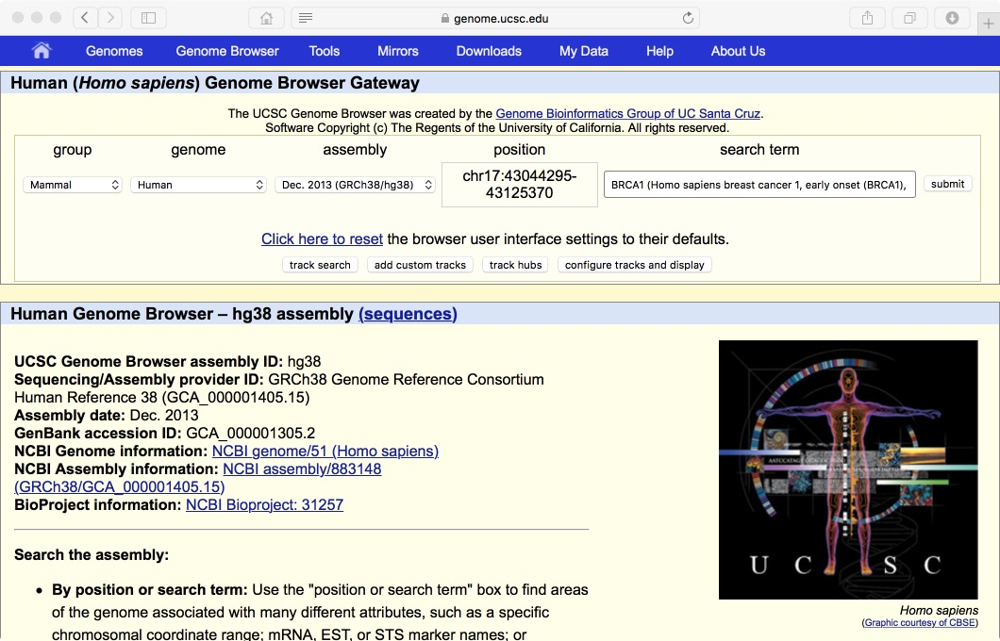
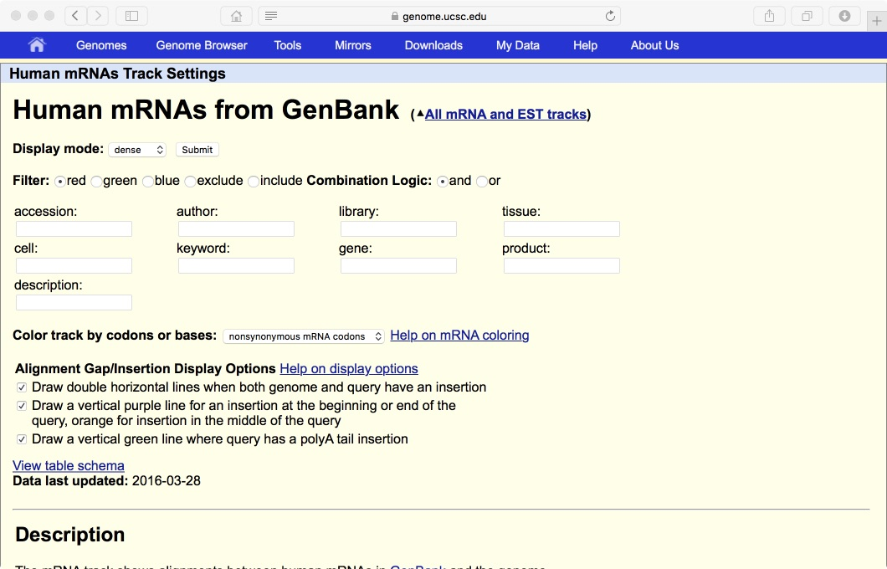
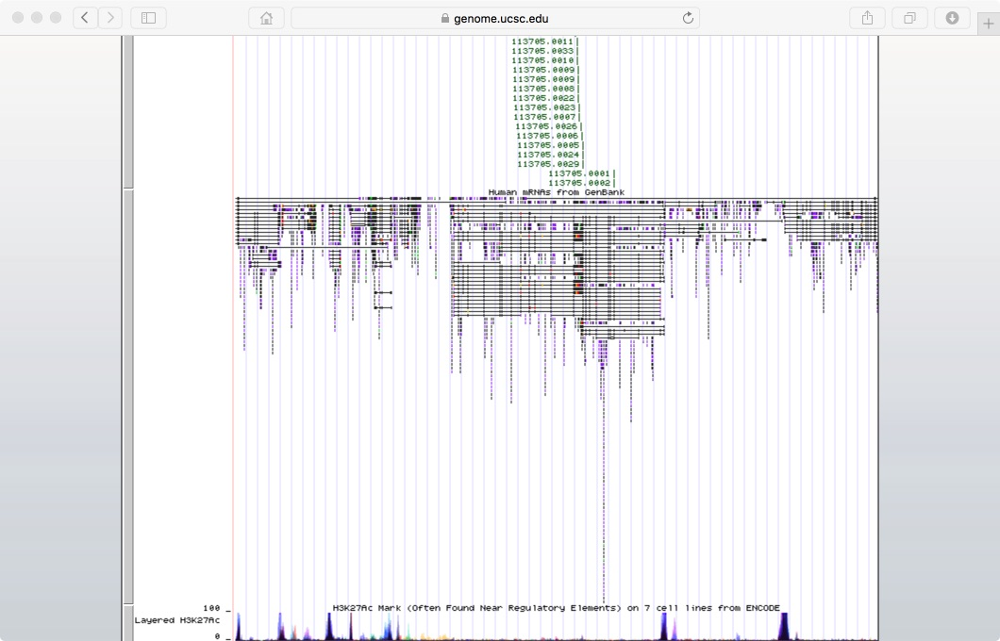
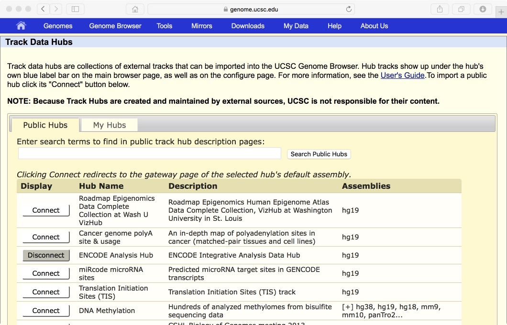
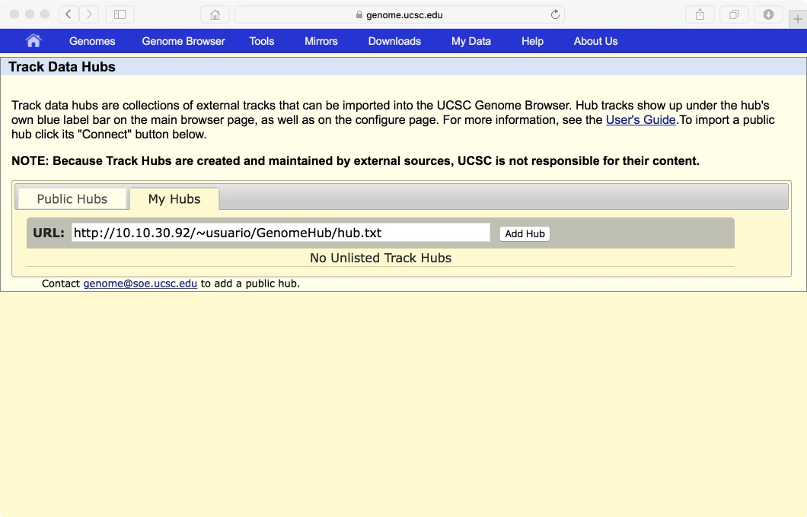

> ## Objetivos de aprendizaje {.objectives}
>
> *  Entender que datos se muestran en un explorador de genomas
> *  Aprender a explorar datos 

> ## Datos requeridos {.prereq}
>
> Para proceder con esta práctica, se requieren los resultados de la clase de mapeo:
>
> *  Archivos de mapeo generados del transcriptoma via GMAP and Tophat2

# Introducción al navegador de genomas UCSC

Uno de los navegadores de genomas más utilizados el de UCSC. Tiene varias copias 
(mirrors) alrededor del mundo y alta funcionalidad. 

Este navegador es útil cuando tenemos acceso al **genoma del organismo de interés**.

Abramos el navegador de genomas. 

[http://genome.ucsc.edu](http://genome.ucsc.edu)

Da click en el link en la esquina 
superior izquierda que dice `Genomes`:

Deberían ver una página similar a esta:

La mayoría de los genomas de organismos modelos están disponibles en el navegador de 
genomas de UCSC. Sin embargo hay muchos que no lo están. Para ver que genomas están
disponibles pueden revisar el menú desplegable debajo del título `genome`.

Naveguemos al gen *Homo sapiens breast cancer 1* o *BRCA1*. 
Mutaciones en este gen se le ha involucrado con riesgo
de padecer cáncer de mama. 

Selecciona en el menú desplegable debajo de `genome` la versión del genoma humano 
`Dec. 2013 (GRCh38/hg38)`. Escribe en el campo llamado `search term` BRCA1, aparecerá 
en la parte de abajo un menú en el cuál puedes seleccionar este gen. Selecciónalo y
da click en `Submit` para desplegarlo en el navegador. 

El navegador despliega distintos tipos de información. Debajo del título que indica que
versión del genoma humano estamos navegando vemos botones que nos permiten movernos a
la derecha o la izquierda en el genoma, así como acercarnos o alejarnos de una región 
con distintas escalas. 

 
Después de estos botones encontramos coordenadas que nos indican en que parte del genoma
nos encontramos. También tenemos un campo de búsqueda que nos permite buscar genes por 
nombre, indicar coordenadas así como buscar información de los datos (tracks) depositados
en el navegador. 

Debajo de este encontramos un mapa del cromosoma 17 (chr17) que es donde se ubica este gen. 
El mapa despliega una barra roja que indica la región en la que nos encontramos, para
así ubicarnos en relación al resto del genoma. 

Finalmente, un recuadro gráfico muestra distintos tipos de datos que se encuentran asociados 
a esta región del genoma humano. En la parte superior encontramos una barra de escala 
que nos da una idea que tan grande o pequeña es la región que observamos, también tenemos
indicadores de la posición en el cromosoma. Debajo de esta se encuentran los datos 
depositados en este genoma. Estos datos se presentan en grupos llamados `tracks`. Cada 
uno de estos `tracks` tiene un título asociado. En el lado izquierdo de cada track 
hay un botón gris que nos permite ajustar con que tanto detalle se presentan los datos
en cada track. 

Antes de proseguir vamos a alejarnos de esta región dando click al botón `3x` a la derecha
de `zoom out`. Esto nos permitira ver no solo el gen BRCA1 sino también sus regiones 
aledañas. 

Los primeros dos tracks nos muestran anotaciones de genes de acuerdo **GENCODE** (1) y a
**RefSeq** (2). En estos tracks los bloques indican exones, mientras que las líneas delgadas
indican intrones. La dirección de transcripción del gen se muestra como pequeñas 
flechas dentro de los intrones apuntando hacia la derecha o la izquierda. 

Debajo de estos vemos otro `track` llamado **OMIM Allelic Variant SNPs**, este tiene 
líneas verdes, cada una de las cuales indica un SNP (single nucleotide polymorphism). 
Debajo de esta hay otro track llamado **Human mRNAs**. Ocupa solo una línea y no es muy 
claro donde empieza y donde termina cada transcrito. Demos click en el botón gris del lado
izquierdo de este track:

Hagamos click en el menú junto a `display mode` y seleccionemos `squish`, una vez seleccionado
demos click en `Submit`. El resultado es el siguiente:

Finalmente, podemos reordenar los tracks haciendo click en su parte izquierda. Cuando el 
`track` se resalta en color verde podemos subirlo o bajarlo con respecto a otros tracks
para cambiar el orden de despliegue. 

A pesar de que no podemos ver las estructuras a detalle nos damos una mejor idea de donde 
hay un transcrito o no. 

# Añadiendo datos nuevos al navegador de genomas UCSC

Como les mencione, hay varios genomas que no están en el navegador de UCSC. Esto incluye
al organismo de nuestro estudio *Saccharomyces pombe*.

Existe una forma de añadir otros genomas de manera temporal al navegador llamado un hub 
de ensamble (`Assembly hub`). Para esto, necesitamos crear una carpeta accesible en línea
desde nuestra computadora para que podamos subir los datos al navegador. 

Volvamos al directorio base de nuestro usuario y creemos un directorio llamado 
`public_html`:

~~~ {.bash}
$ cd
$ mkdir public_html 
$ cd public_html
~~~

En este directorio vamos a generar nuestro assembly hub. 

Tiene que tener la siguiente estructura:

~~~ {.output}
myHub/ - Directorio para organizar los archivos del hub
     hub.txt – Archivo de texto plano para definir el hub:
     genomes.txt – Definiciones de cada genoma en este hub
          newOrg1/ - Directorio de archivos para un genoma particular
               newOrg1.2bit – Archivo en formato ‘2bit’ construido a partir de la secuencia fasta
               description.html – información acerca de este ensamble para otros usuarios
               trackDb.txt – definiciones de tracks en este ensamble
               groups.txt – definiciones de grupos de tracks en este ensamble
               bam, bigWig and bigBed files – data para tracks en este ensamble
~~~

Creemos primero los archivos base:

~~~ {.bash}
$ mkdir GenomeHub
$ cd GenomeHub 
$ gedit hub.txt
~~~

En este archivo `hub.txt` escribiremos lo siguiente (sustituyan NOMBRE por su nombre):

~~~ {.output}
hub Sp_genome_hub
shortLabel Saccharomyces pombe Genome (NOMBRE)
longLabel Saccharomyces pombe Genome and tracks setup by NOMBRE
genomesFile genomes.txt
email myemail@mysite.com
descriptionURL aboutHub.html
~~~

Y en el archivo `genomes.txt` escribiremos lo siguiente:

~~~ {.bash}
$ gedit genomes.txt
~~~

~~~ {.output}
genome sacPom1
trackDb sacPom1/trackDb.txt
groups sacPom1/groups.txt
description Saccharomyces pombe Genome
twoBitPath sacPom1/sacPom1.2bit
organism Saccharomyces pombe
#defaultPos EQ973772:1000000-2000000
scientificName Saccharomyces pombe
htmlPath sacPom1/description.html
~~~

### Generando archivos

Para generar los archivos necesarios para nuestro hub debemos descargar los siguientes
programas:

* [faToTwoBit](http://hgdownload.soe.ucsc.edu/admin/exe/linux.x86_64/faToTwoBit)
* [twoBitInfo](http://hgdownload.soe.ucsc.edu/admin/exe/linux.x86_64/twoBitInfo)

Y vamos a descargar a copiar el genoma al que mapeamos a este directorio. Si no lo 
tienen lo pueden descargar de aquí [Sp_genome.fa](datasets/genome/Sp_genome.fa).

Generamos la referencia y la movemos al directorio `sacPom1`:

~~~ {.bash}
$ faToTwoBit Sp_genome.fa sacPom1.2bit
$ mkdir sacPom1
$ mv sacPom1.2bit sacPom1/
~~~

Generamos la información acerca del tamaño de los cromosomas:

~~~ {.bash}
$ twoBitInfo sacPom1.2bit stdout | sort -k2rn > sacPom1.chrom.sizes
~~~

Una vez generados nuestros archivos entramos al directorio sacPom1. Movemos ahí los 
archivos generados en la clase de mapeo. 

*  trinity_gmap.bam
*  trinity_gmap.bai
*  accepted_reads.bam

~~~ {.bash}
$ cd sacPom1
$ mv trinity_gmap.bam trinity_gmap.bai accepted_reads.bam .
~~~ 

Finalmente vamos a hacer un índice para los hits de tophat

~~~ {.bash}
$ samtools sort accepted_reads.bam accepted_reads_sorted
$ samtools index accepted_reads_sorted.bam
~~~ 

Crearemos un archivo llamado `trackDb.txt`. Este es uno de los archivo más importantes 
ya que especifica como se muestran los tracks. 

Agreguemos nuestro primeros tracks con los resultados de TopHat2 y GMAP

~~~ {.bash}
$ gedit trackDb
~~~

~~~ {.output}
#database: sacPom1 - esto es un comentario

track TopHat2_Mapping_Reads
bigDataUrl http://**<IP>**/~usuario/GenomeHub/sacPom1/accepted_reads_sorted.bam
shortLabel TopHat2_Mapping
longLabel Paired end reads Sp exp mapped with TopHat2
pairEndsByName on
showNames on
bamColorMode strand
#bamGrayMode unpaired
baseColorDefault diffBases
baseColorUseSequence lfExtra
type bam
#noColorTag .
#aliQualRange 0:60
indelDoubleInsert on
indelQueryInsert on
pairSearchRange 5000
#showDiffBasesAllScales .
showDiffBasesMaxZoom 100
maxWindowToDraw 1000000
visibility hide
showNames off

track transcriptome_GMAP
bigDataUrl http://**<IP>**/~usuario/GenomeHub/sacPom1/trinity_gmap.bam
shortLabel transcriptome_GMAP
longLabel Trinity transcriptome mapped with GMAP
pairEndsByName off
showNames on
bamColorMode strand
#bamGrayMode unpaired
baseColorDefault diffBases
baseColorUseSequence lfExtra
type bam
#noColorTag .
#aliQualRange 0:60
indelDoubleInsert on
indelQueryInsert on
pairSearchRange 5000
#showDiffBasesAllScales .
showDiffBasesMaxZoom 100
maxWindowToDraw 1000000
visibility hide
showNames off
~~~ 

Las especificaciones de otros tipos de tracks se pueden consultar en este [link](https://genome.ucsc.edu/goldenpath/help/trackDb/trackDbHub.html).

Activamos nuestro directorio para que pueda ser visto desde la red:

~~~ {.bash}
sudo service apache2 start
sudo a2enmod userdir.conf
sudo service apache2 reload
chmod -R 755 ~/public_html
~~~

Para verificar que funciona navegaremos a nuestro IP. Averiguamos nuestro IP con el 
comando:

~~~ {.bash}
ip a | grep inet | grep eth1
~~~

Nuestra IP es el primer número después de inet. Navegamos al hub:

[http://10.10.30.92/~usuario/GenomeHub/hub.txt](http://10.10.30.92/~usuario/GenomeHub/hub.txt)

Pongan su IP en vez de la del ejemplo:

Finalmente abrimos el navegador de genomas y damos click en la parte de abajo de la 
ventana de navegación en el botón `track hubs`. Esto nos lleva a la página siguiente:

Pegamos nuestra dirección y damos click en `Add Hub`. 

Si todo salió bien nos redirigira a nuestro hub. 

# Usando el navegador de genomas/transcriptomas IGV

Este navegador lo podemos utilizar cuando no tenemos acceso al genoma. 

> ## Tarea - Alineando las lecturas filtradas al transcriptoma {.challenge}
>
> Hemos alineado las lecturas al genoma pero queremos alinearlas también directamente
> al transcriptoma. La tarea consiste en revisar el manual de TopHat2 y usar las opciones
> que nos permite mapear lecturas directamente a transcriptomas. 
> 
> Agreguen el archivo Trinity.fasta de referencia y el archivo de mapeo en formato BAM
> (ordenado e indizado) a su repositorio en un nuevo directorio llamado Transcriptome_Mapping.
> También agreguen un archivo de texto plano con el commando que utilizaron para realizar
> este análisis.
> Lo deberán agregar antes de la clase del viernes 8 de abril.
> 
> * **Pista 1:** No podrán utilizar el índice generado previamente.
> * **Pista 2:** No deberán iniciar un nuevo repositorio, solo tienen que agregar el nuevo 
> directorio y su contenido. 

